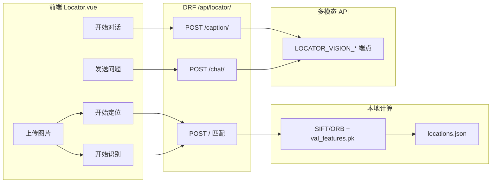

# 智能识图板块 — 技术路线

本文档梳理「智能识图」页面（`/locator`，`Locator.vue`）及其依赖后端模块的实现路径，与仓库代码保持一致。

---

## 1. 模块定位

| 维度 | 说明 |
|------|------|
| 产品目标 | 通过图像与参考库匹配，推断**地理位置 / 场景**；在此基础上提供**中文描述**与**多轮视觉问答**。 |
| 前后端 | Vue 3（Ant Design Vue）+ Django REST Framework；请求经 JWT 鉴权。 |
| 路由 | 前端：`/locator`；导航与首页卡片文案为「智能识图」。 |

---

## 2. 能力拆分（与当前实现对齐）

### 2.1 图像匹配（定位与「识别」Tab 共用）

- **能力**：将用户图与预建特征库做相似检索，返回最匹配的库图文件名、**地点文案**、**匹配分数**。
- **算法链路**：OpenCV **SIFT**（可配置为 ORB）提取特征 → 与 `val_features.pkl` 中向量比对 → 通过 `locations.json` 将库图名映射为中文地点（`locator/utils.py`）。
- **接口**：`POST /api/locator/`，表单字段 `file`。
- **前端**：「开始定位」与「开始识别」均调用同一封装 `locatorUpload`（`api.js` → `/locator/`）。区别仅在于结果 Tab：**定位**带百度地图地理编码；**识别** Tab 不展示地图，其余字段一致。

### 2.2 多模态描述与视觉问答（VQA）

- **图像描述**：`POST /api/locator/caption/`，上传 `file`，可选 `locator_context`（JSON，来自上一步匹配结果，写入提示词）。
- **视觉问答**：`POST /api/locator/chat/`，`multipart` 中 `file` + `meta`（JSON：`caption`、`history`、`question`，可选 `locator_context`）。
- **模型侧**：走 `locator/deepseek_client.py` 中 OpenAI 兼容的多模态调用；需在环境变量中配置独立视觉端点（见第 5 节），与纯文本 `deepseek-chat` 区分。

### 2.3 辅助能力

- **库图预览**：`GET /api/locator/db-image/<filename>/`（从数据集 `val/database` 读图；视图为 `AllowAny`，按部署需注意安全）。
- **百度地图**：前端 `VITE_BAIDU_MAP_AK`，根据拼接后的地址字符串做地理编码与标点（仅定位 Tab）。

### 2.4 后端已提供、当前智能识图页未接入的能力

- **`POST /api/locator/recognize/`**：本地 **RF-DETR** + COCO 类别目标检测，输出检测列表与带框可视化图（`locator/recognizer/utils.py`）。前端 `api.js` 中有 `recognizeUpload`，**未被 `Locator.vue` 引用**。若产品需要「通用物体检测」Tab，可在此接口上扩展 UI。

---

## 3. 总体数据流

---

## 4. 技术栈要点

| 层级 | 技术 |
|------|------|
| 前端 | Vue 3、Vite、Ant Design Vue、`fetch` + 统一鉴权封装 |
| 匹配后端 | OpenCV、自研 `ImageLocalizer`、特征持久化 pickle |
| 检测后端（可选） | PyTorch、RF-DETR、`supervision` 画框 |
| 多模态 | OpenAI 兼容 HTTP API（由 `LOCATOR_VISION_*` 指定） |

---

## 5. 配置与环境变量

| 变量 / 配置项 | 作用 |
|----------------|------|
| `LOCATOR_DATASET_ROOT`、`LOCATOR_FEATURES_PATH`、`LOCATOR_LOCATIONS_MAP` | 数据集根目录、特征库路径、地点映射 JSON |
| `LOCATOR_FEATURE_TYPE` | `sift` 或 `orb` |
| `RFDETR_WEIGHTS_PATH` | RF-DETR 权重（仅 `/recognize/` 使用） |
| `RECOGNIZE_TMP_DIR` | 识别接口临时目录 |
| `DEEPSEEK_API_KEY` 等 | 文本对话默认；看图需单独配置视觉端点 |
| `LOCATOR_VISION_BASE_URL`、`LOCATOR_VISION_API_KEY`、`LOCATOR_VISION_MODEL` | 多模态 caption / VQA（`settings.py` 注释：官方 `deepseek-chat` 不支持 `image_url` 时需指向支持多模态的兼容服务） |
| `VITE_BAIDU_MAP_AK` | 前端百度地图脚本 AK |

---

## 6. 演进建议（非已实现需求）

1. **统一命名**：界面「开始识别」与 Tab「识别结果」在代码层与「定位」同源；若需 COCO 物体检测，可接入 `recognizeUpload` 或合并为一步后端编排。
2. **鉴权**：`DatabaseImageView` 为公开读取，生产环境建议改为登录后可访问或签名 URL。
3. **性能**：匹配与 RF-DETR 均可考虑异步任务 + 轮询/ WebSocket，避免大图上请求超时。

---

*文档与仓库同步整理日期：2026-04-14*
