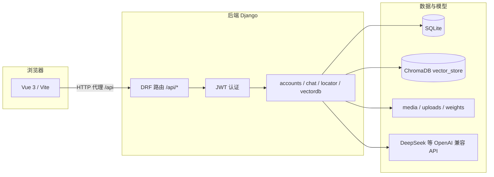

# AI Agent 智能体平台 · 软件说明书

本文档面向系统使用者与维护人员，说明本软件的架构、部署方式、配置项、界面功能与接口约定，便于在无源码阅读成本的前提下完成安装、登录与主要业务流程。

**文档版本**：与仓库代码同步（后端 Django 5.2.x、前端 Vite 7.x + Vue 3）  
**编写日期**：2026-04-19  

---

## 1. 本章/文档定位

- **目的**：指导在本地或内网环境中安装依赖、配置密钥、启动前后端，并完成知识库对话、图像定位/识别/描述与视觉问答、向量库管理等主要操作。  
- **读者对象**：课题组成员、运维人员、答辩评审中需要复现演示的人员。  
- **与系统设计章节的关系**：设计/实现章节侧重算法与模块设计；本文侧重**可运行性**与**操作步骤**，代码级细节以仓库源码及 OpenAPI 文档为准。

---

## 2. 软件概述

### 2.1 名称与功能范围

本系统为 **AI 智能体应用平台**（仓库名 `ai_agent`），在前后端分离架构下提供：

| 能力 | 说明 |
|------|------|
| 用户认证 | 注册、登录、JWT（access/refresh）、角色（`user` / `admin`） |
| RAG 对话 | 基于 ChromaDB 的检索增强生成；支持 SSE 流式输出；多会话线程 |
| 向量知识库 | 管理员上传文档（PDF/DOCX/TXT/PPT/Markdown 等），切块嵌入后写入向量库 |
| 图像定位 | 上传图像，基于 OpenCV SIFT/ORB 与预计算特征匹配场景位置 |
| 目标检测 | RF-DETR 检测，返回 COCO 类别与置信度，并生成标注图 URL |
| 图像描述 / 视觉问答 | 调用可配置的多模态（视觉）API 生成描述或基于图像问答 |

**非目标边界**（答辩与文档中建议主动说明）：生产级高可用集群、细粒度审计日志、完整的模型训练流水线（训练脚本存在于 `locator/sift/` 等目录，属研发辅助，非 Web 产品必备路径）。

### 2.2 总体架构

系统为典型的 **Vue 单页应用 + Django REST API**：



### 2.3 后端应用划分

| Django App | 职责 |
|------------|------|
| `accounts` | 自定义用户模型、注册、JWT、当前用户 `me` |
| `chat` | 会话线程、聊天记录、RAG + DeepSeek 文本生成（含 SSE） |
| `locator` | 图像上传；定位、检测、描述、视觉问答 |
| `vectordb` | 管理员文档上传触发向量化、向量条目列表与删除 |

---

## 3. 运行环境与依赖

### 3.1 硬件建议

| 场景 | 建议 |
|------|------|
| 开发与演示 | CPU 可运行；向量嵌入、重排序、RF-DETR 在有 **NVIDIA GPU + CUDA** 时明显更快 |
| 无 GPU | `sentence-transformers` / `CrossEncoder` / `torch` 可走 CPU，速度较慢；需保证内存足够加载 BGE-M3 与 bge-reranker |

### 3.2 软件环境

| 组件 | 说明 |
|------|------|
| Python | 与 `requirements.txt` 一致（项目使用 Django 5.2.x、PyTorch 2.7.x 等） |
| Node.js | 建议 LTS，用于构建与运行前端（Vite 7） |
| 操作系统 | 开发以 Windows/Linux 均可；路径在 `settings.py` 中使用 `pathlib`，注意媒体与权重目录权限 |

### 3.3 主要第三方与本地资源

- **必需**：`DEEPSEEK_API_KEY`（文本对话；部分视觉能力亦依赖密钥，见下文）。  
- **本地模型目录**（默认位于 `chat/models/`）：`bgem3`（嵌入）、`bge-reranker`（重排）。  
- **检测权重**：`weights/rf-detr-base.pth`（由 `settings.RFDETR_WEIGHTS_PATH` 指定）。  
- **定位数据**：`locator/sift/` 下特征与 `locations.json` 等（由 `LOCATOR_*` 配置指向）。  
- **向量库持久化**：项目根目录下 `vector_store/`（ChromaDB `PersistentClient`）。  
- **关系库**：根目录 `db.sqlite3`。  
- **异步任务**：`CELERY_TASK_ALWAYS_EAGER = True` 时任务**同步执行**，无需单独启动 Celery Worker/Redis。

---

## 4. 安装与部署

### 4.1 获取代码与 Python 虚拟环境

```bash
cd ai_agent
python -m venv .venv
# Windows:
.venv\Scripts\activate
pip install -r requirements.txt
```

> **说明**：`requirements.txt` 中含 `torch==2.7.1+cu128`，需与机器 CUDA 版本匹配；若安装失败，请按 PyTorch 官网说明选择对应 wheel 源或 CPU 版本，并自行承担与检测/嵌入代码的兼容性风险。

### 4.2 环境变量（根目录 `.env`）

在项目根目录创建 `.env`（**勿提交仓库**）。`backend/settings.py` 使用 `python-dotenv` 加载。常用变量如下：

| 变量 | 含义 |
|------|------|
| `DEEPSEEK_API_KEY` | DeepSeek API 密钥（文本聊天；无多模态端点时视觉能力也可能回退或使用同一 Key） |
| `DEEPSEEK_BASE_URL` | 可选，默认 `https://api.deepseek.com` |
| `DEEPSEEK_MODEL` | 可选，默认 `deepseek-chat` |
| `LOCATOR_VISION_BASE_URL` | 多模态接口 Base URL（**官方 deepseek-chat 不支持 image_url** 时需配置兼容端点） |
| `LOCATOR_VISION_API_KEY` | 视觉 API Key；未设置时可回退为 `DEEPSEEK_API_KEY` |
| `LOCATOR_VISION_MODEL` / `DEEPSEEK_VISION_MODEL` | 多模态模型名 |

### 4.3 数据库迁移与管理账号

```bash
python manage.py migrate
python manage.py createsuperuser
```

- **普通用户**：可通过前端注册接口创建（`role` 默认为 `user`）。  
- **向量库相关 API**（`/api/vdb/*`）在后端使用 **`IsAdminUser`**，等价于要求用户 **`is_staff=True`**（且已激活）。  
- **前端页面 `/vdb`** 依赖登录后 **`/api/accounts/me/`** 返回的自定义字段 **`role === 'admin'`**。  
  实践中请保证二者一致：在 Django Admin 或后台中将该用户 **`is_staff` 勾选**，并把 **`role` 设为 `admin`**，否则可能出现「前端能进页面但接口 403」或「接口能调但前端被路由拦住」的现象。超级用户（`createsuperuser`）默认具备 Staff 权限，仍需按需设置 `role` 字段以便前端导航。

### 4.4 静态资源与权重检查

部署前请确认：

- `chat/models/bgem3`、`chat/models/bge-reranker` 已就位（或修改 `EMBED_MODEL_PATH` / `RERANK_PATH`）。  
- `weights/rf-detr-base.pth` 存在。  
- `locator/sift/` 下定位所需的 `val_features.pkl`、`locations.json` 及数据集路径与 `settings` 中配置一致。

### 4.5 前端安装与开发服务器

```bash
cd my-frontend
npm install
npm run dev
```

- 开发模式下 Vite 将 `/api` **代理**到 `http://127.0.0.1:8000`（见 `my-frontend/vite.config.js`）。  
- 前端默认开发端口一般为 **5173**（以控制台输出为准）。

### 4.6 启动后端

```bash
# 在项目根目录（含 manage.py）
python manage.py runserver 0.0.0.0:8000
```

- 媒体文件通过 `MEDIA_URL` / `MEDIA_ROOT` 暴露；定位识别结果图片 URL 依赖后端站点 URL（检测接口中会 `build_absolute_uri`）。

### 4.7 生产部署提示（简要）

当前仓库 `DEBUG = True`、`ALLOWED_HOSTS = []`，**仅供开发**。若对外部署：关闭 DEBUG、配置 ALLOWED_HOSTS、HTTPS、密钥与 `SECRET_KEY`、静态文件与媒体分离、替换 SQLite 等需另行按 Django 官方清单执行（超出本文范围）。

---

## 5. 访问入口与认证

### 5.1 服务地址

| 用途 | 地址（默认） |
|------|----------------|
| 后端 API | `http://127.0.0.1:8000` |
| API 文档（Swagger） | `http://127.0.0.1:8000/docs/`（Schema：`/schema/`） |
| Django Admin | `http://127.0.0.1:8000/admin/` |
| 前端（开发） | `http://127.0.0.1:5173` |

### 5.2 JWT 使用方式

1. `POST /api/accounts/token/`，请求体：`{"username","password"}`，获得 `access` 与 `refresh`。  
2. 业务请求头：`Authorization: Bearer <access>`。  
3. Access 过期后：`POST /api/accounts/token/refresh/` 传入 `refresh` 换新 `access`。  

全文接口（除另行声明外）默认需要登录，与 `REST_FRAMEWORK` 中 `IsAuthenticated` 一致。

---

## 6. 前端功能与页面说明

路由定义于 `my-frontend/src/router/index.js`：

| 路径 | 页面 | 权限 |
|------|------|------|
| `/login` | 登录 | 无布局；已登录会转首页 |
| `/` | 首页 | 需登录 |
| `/chat` | RAG 对话 | 需登录；支持 SSE 流式 |
| `/locator` | 图像定位 / 检测 / 描述 / 问答 | 需登录 |
| `/vdb` | 向量库构建与管理 | 需登录且 **`admin` 角色** |

---

## 7. 后端 API 概要

完整请求/响应结构见 **`openapi.yaml`** 及联机文档 **`/docs/`**。下表便于快速检索：

| 模块 | 方法 | 路径 | 说明 |
|------|------|------|------|
| accounts | POST | `/api/accounts/register/` | 注册 |
| accounts | POST | `/api/accounts/token/` | 获取 JWT |
| accounts | POST | `/api/accounts/token/refresh/` | 刷新 access |
| accounts | GET | `/api/accounts/me/` | 当前用户 |
| chat | POST | `/api/chat/` | 聊天；`Accept: text/event-stream` 时为 SSE |
| chat | GET/POST | `/api/chat/threads/` | 会话列表 / 新建 |
| chat | PATCH | `/api/chat/threads/<uuid>/` | 更新标题等 |
| chat | DELETE | `/api/chat/threads/<uuid>/delete/` | 删除会话 |
| chat | GET | `/api/chat/threads/<uuid>/messages/` | 消息列表 |
| chat | DELETE | `/api/chat/threads/<uuid>/messages/` | 清空消息 |
| locator | POST | `/api/locator/` | 图像定位，`multipart` 字段名 `file` |
| locator | GET | `/api/locator/db-image/<filename>/` | 数据库侧参考图（读权限见视图） |
| locator | POST | `/api/locator/recognize/` | 目标检测，`file` |
| locator | POST | `/api/locator/caption/` | 图像描述；可选 `locator_context`（JSON 字符串） |
| locator | POST | `/api/locator/chat/` | 视觉问答；`file` + `meta`（JSON：caption、history、question 等） |
| vectordb | POST | `/api/vdb/upload/` | 批量上传文档，**仅管理员**；返回 `202` 与 `task_id` |
| vectordb | GET | `/api/vdb/files/` | 列出向量片段，**仅管理员** |
| vectordb | DELETE | `/api/vdb/files/` 或 `/api/vdb/files/<doc_hash>/` | 清空或按文档删除，**仅管理员** |

### 7.1 聊天与 RAG 行为摘要

- 会话与最近 **5** 轮历史会作为上下文传给模型（见 `chat/views.py`）。  
- 若 Chroma 集合存在且查询距离 **小于 `MAX_DIST`（0.5）**，则执行 MMR 检索 + CrossEncoder 重排，取 Top **3**（`TOP_N`）拼接进提示词；否则直接走纯模型回答。  
- SSE 流结束时事件中含 `source_documents` 便于前端展示引用来源。

### 7.2 向量库构建（管理员）

- 上传：`multipart`，字段 `files` 为多文件列表。  
- 任务处理 `uploads/` 目录下文件，切块后写入 `vector_store`，含 **MD5 去重** 逻辑；处理完成后清理上传目录（以 `vectordb/tasks.py` 实现为准）。

---

## 8. 数据与文件存储

| 位置 | 内容 |
|------|------|
| `db.sqlite3` | 用户、会话、聊天记录 |
| `vector_store/` | ChromaDB 持久化集合（默认名 `default`） |
| `uploads/` | 向量化前的临时上传 |
| `media/` | 识别图、临时处理文件等（含 `recognize`、`locator_tmp` 等子目录） |
| `cache/` | 部分运行期配置缓存（如存在） |

---

## 9. 配置项（settings 摘要）

除 `.env` 外，关键项在 `backend/settings.py`：

- `EMBED_MODEL_PATH`、`RERANK_PATH`：嵌入与重排模型路径。  
- `VECTOR_DIR`、`COLLECTION_NAME`：Chroma 目录与集合名。  
- `LOCATOR_FEATURE_TYPE`：`sift` 或 `orb`。  
- `RFDETR_WEIGHTS_PATH`：检测模型权重。  
- `SIMPLE_JWT`：access 约 60 分钟、refresh 约 7 天（以文件为准）。

---

## 10. 权限与安全

- 默认全局 `IsAuthenticated`；向量库写操作使用 `IsAdminUser` 或等价逻辑。  
- **不得**将真实 API Key、数据库文件、向量库一并提交公开仓库；`.env` 仅本地或密钥管理注入。  
- `SECRET_KEY`、`DEBUG`、`ALLOWED_HOSTS` 在生产环境必须按规范收紧。

---

## 11. 常见问题（FAQ）

| 现象 | 可能原因 | 处理方向 |
|------|-----------|----------|
| 前端 401、跳转登录 | Token 过期或未带 Bearer | 重新登录或刷新 refresh |
| `/vdb` 显示无权限或接口 403 | `role` 非 admin 或未勾选 `is_staff` | 将用户设为 `role=admin` 且 `is_staff=True`（见 4.3 节） |
| 对话无检索效果 | 向量库为空或距离阈值未满足 | 管理员上传文档并确认 `vector_store` 非空；调低阈值属二次开发 |
| 图像描述/问答失败 | 未配置视觉端点或多模态 Key | 配置 `LOCATOR_VISION_*`；阅读 `caption`/`vqa` 报错提示 |
| RF-DETR 报错 | 权重路径不存在或 CUDA/内存不足 | 检查 `weights/` 与设备 |
| CORS 错误 | 前端 origin 不在白名单 | 开发环境包含 `localhost:5173`；自定义端口需在 `CORS_ALLOWED_ORIGINS` 增加 |

---

## 12. 日志与维护

- Django 控制台输出：请求错误、任务异常 traceback（向量化任务内 `print`/`traceback`）。  
- **备份**：定期备份 `db.sqlite3`、`vector_store/`、自定义 `uploads/` 及 `media/` 中需保留的识别结果。  
- **升级依赖**：升级 `torch`、`chromadb` 等大版本前建议在虚拟环境中完整回归对话、向量与图像三条链路。

---

## 13. 文档与源码索引

| 资源 | 路径 |
|------|------|
| OpenAPI 规范 | `openapi.yaml` |
| 交互式文档 | 启动后端后访问 `/docs/` |
| 项目结构与技术说明（另一份内部文档） | `项目说明文档.md` |

---

**说明**：若作为学位论文第六章「软件说明书」，可在上一节增加「本章小结」，用一段话概括系统交付形态、安装要点与使用边界，并与前文创新点呼应；本文保持为独立可交付的用户/维护手册正文。
