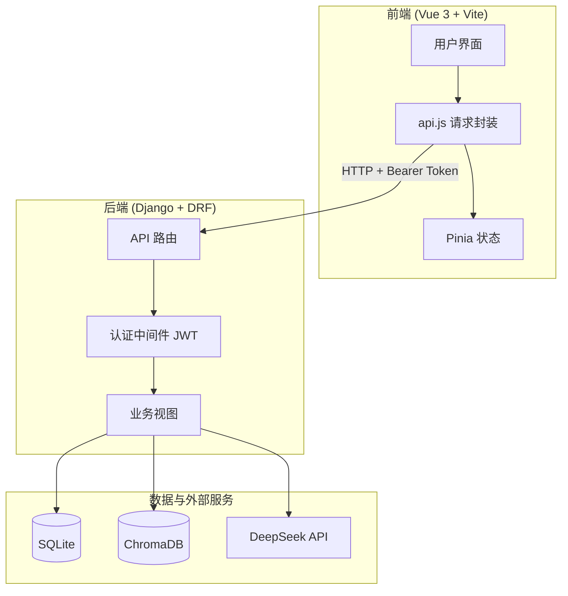
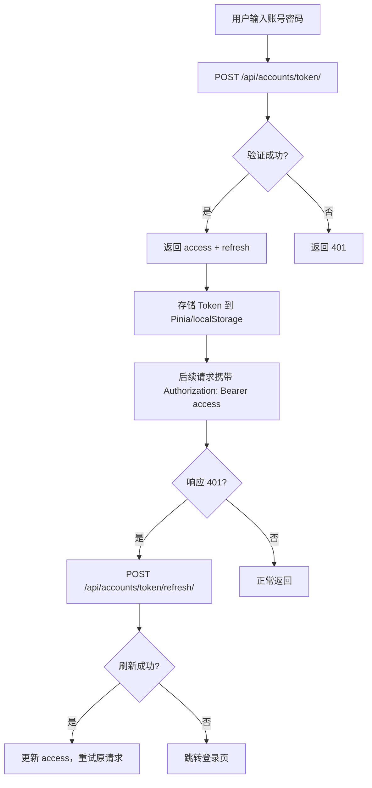
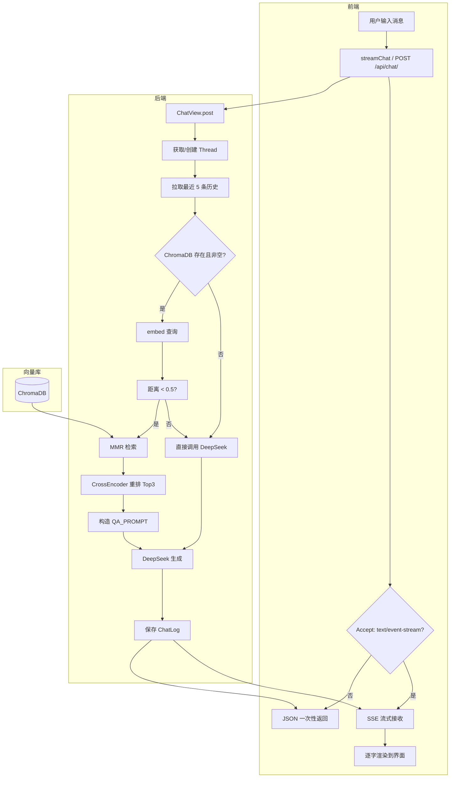
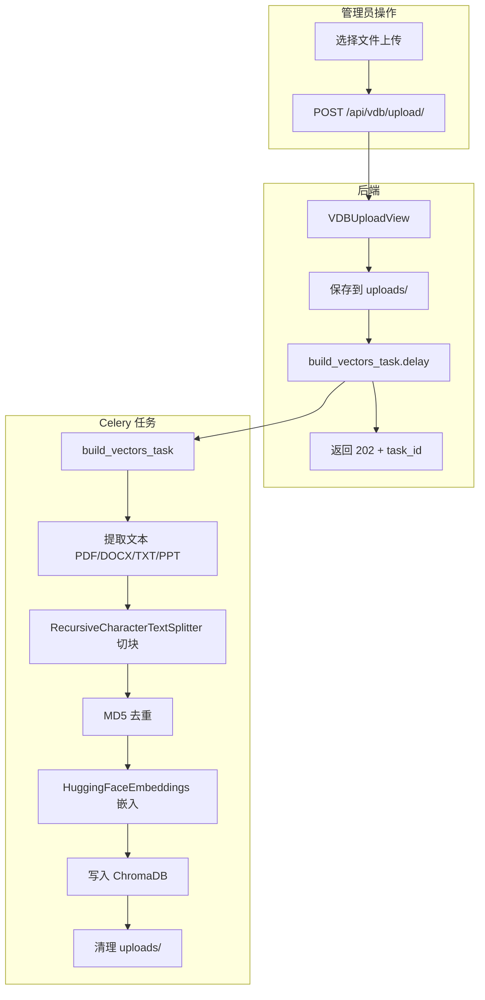
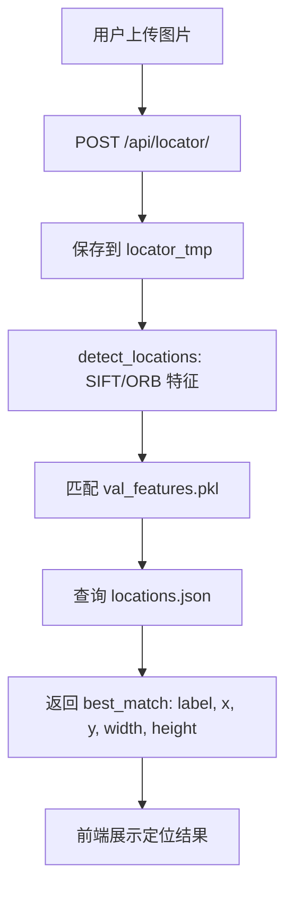
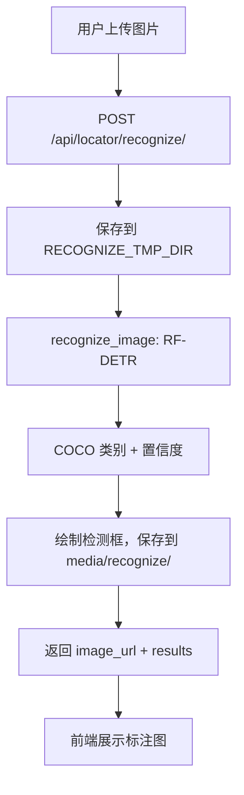
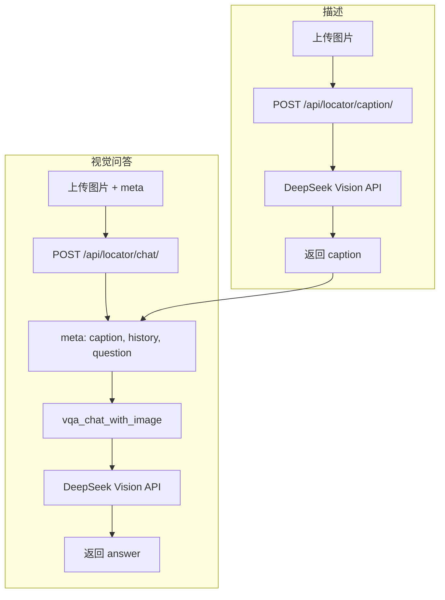

# AI Agent 项目说明文档

## 一、项目概述

本项目是一个 AI 智能体平台，集成了多模态能力：**知识库 RAG 对话**、**图像定位**、**目标检测识别**、**图像描述与视觉问答**，以及**向量知识库管理**。采用前后端分离架构，后端基于 Django REST Framework，前端基于 Vue 3。

---

## 二、技术方案

### 2.1 后端技术栈

| 层级 | 技术 | 版本/说明 |
|------|------|-----------|
| Web 框架 | Django | 5.2.5 |
| API 框架 | Django REST Framework | 3.16 |
| 认证 | JWT (djangorestframework-simplejwt) | 5.5 |
| CORS | django-cors-headers | 4.7 |
| API 文档 | drf-spectacular | OpenAPI 3.0 / Swagger |
| 向量数据库 | ChromaDB | 1.0.20 |
| 大语言模型 | DeepSeek API | OpenAI 兼容接口 |
| 嵌入模型 | sentence-transformers / langchain-huggingface | BGE-M3 |
| 重排序 | CrossEncoder (bge-reranker) | - |
| 目标检测 | RF-DETR + supervision | - |
| 图像定位 | OpenCV (SIFT/ORB) | - |
| 异步任务 | Celery | 开发环境同步执行 |
| 数据库 | SQLite | db.sqlite3 |

### 2.2 前端技术栈

| 层级 | 技术 | 说明 |
|------|------|------|
| 框架 | Vue 3 | 3.5 |
| 构建工具 | Vite | 7.x |
| 路由 | vue-router | 4.x |
| 状态管理 | Pinia | 3.x |
| UI 组件库 | Ant Design Vue、Naive UI | - |
| Markdown 渲染 | marked + highlight.js | - |
| HTTP 请求 | fetch (自定义 api.js 封装) | 支持 JWT 刷新 |

---

## 三、项目结构

```
ai_agent/
├── manage.py                    # Django 入口
├── requirements.txt             # Python 依赖
├── .env                         # 环境变量 (DEEPSEEK_API_KEY 等)
├── openapi.yaml                 # OpenAPI 3.0 规范
│
├── backend/                     # Django 配置
│   ├── settings.py
│   ├── urls.py
│   └── wsgi.py
│
├── accounts/                    # 用户认证模块
│   ├── models.py                # User 模型
│   ├── views.py                 # 注册、登录、me
│   ├── serializers.py
│   └── urls.py
│
├── chat/                        # RAG 对话模块
│   ├── models.py                # Thread、ChatLog
│   ├── views.py                 # 聊天、线程、消息
│   ├── services.py              # 向量检索 + DeepSeek 生成
│   ├── serializers.py
│   └── urls.py
│
├── locator/                     # 图像定位与视觉模块
│   ├── views.py                 # 定位、识别、描述、VQA
│   ├── utils.py                 # SIFT/ORB 定位
│   ├── caption/utils.py         # 图像描述
│   ├── chat/utils.py            # 视觉问答
│   ├── recognizer/utils.py     # RF-DETR 目标检测
│   └── urls.py
│
├── vectordb/                    # 向量库管理模块
│   ├── views.py                 # 上传、列表、删除
│   ├── tasks.py                 # Celery 向量化任务
│   └── urls.py
│
├── media/                       # 上传文件、识别结果
├── vector_store/                # ChromaDB 持久化
├── uploads/                     # 临时上传（向量化前）
├── chat/models/                 # 嵌入模型 (bgem3, bge-reranker)
├── weights/                     # RF-DETR 权重
│
└── my-frontend/                 # Vue 3 前端
    ├── package.json
    ├── vite.config.js
    └── src/
        ├── main.js
        ├── App.vue
        ├── api.js               # API 客户端 + 认证
        ├── router/index.js
        ├── stores/user.js       # Pinia 用户状态
        ├── views/
        │   ├── Home.vue
        │   ├── Login.vue
        │   ├── ChatPage.vue
        │   ├── Locator.vue
        │   └── VectorBuilder.vue
        └── components/
            ├── ChatLayout.vue
            ├── ThreadList.vue
            ├── MessageList.vue
            ├── MessageBubble.vue
            └── InputBox.vue
```

---

## 四、数据流向与流程图

### 4.1 整体架构数据流



### 4.2 用户认证流程



### 4.3 RAG 聊天数据流（含 SSE 流式）



### 4.4 向量库构建数据流



### 4.5 图像定位数据流



### 4.6 图像识别数据流



### 4.7 图像描述与视觉问答数据流



### 4.8 前端路由与权限

```mermaid
flowchart TD
    A[路由守卫 beforeEach] --> B{requireAuth?}
    B -->|是| C{已登录?}
    B -->|否| D[放行]
    C -->|否| E[跳转 /login]
    C -->|是| F{requireRole?}
    F -->|否| D
    F -->|admin| G{role === admin?}
    G -->|是| D
    G -->|否| H[重定向 /chat]

    subgraph 路由表
        R1[/login - 无布局]
        R2[/ - Home]
        R3[/chat - ChatPage]
        R4[/locator - Locator]
        R5[/vdb - VectorBuilder 仅 admin]
    end
```

---

## 五、API 接口汇总

| 模块 | 方法 | 路径 | 说明 |
|------|------|------|------|
| **accounts** | POST | `/api/accounts/register/` | 注册 |
| | POST | `/api/accounts/token/` | 登录获取 JWT |
| | POST | `/api/accounts/token/refresh/` | 刷新 access |
| | GET | `/api/accounts/me/` | 当前用户信息 |
| **chat** | POST | `/api/chat/` | 聊天（支持 SSE 流式） |
| | GET/POST | `/api/chat/threads/` | 线程列表/新建 |
| | PATCH | `/api/chat/threads/<uuid>/` | 更新线程标题 |
| | DELETE | `/api/chat/threads/<uuid>/delete/` | 删除线程 |
| | GET | `/api/chat/threads/<tid>/messages/` | 消息列表 |
| | DELETE | `/api/chat/threads/<tid>/messages/` | 清空消息 |
| **locator** | POST | `/api/locator/` | 图像定位 |
| | GET | `/api/locator/db-image/<filename>/` | 数据库图片 |
| | POST | `/api/locator/recognize/` | 目标检测 |
| | POST | `/api/locator/caption/` | 图像描述 |
| | POST | `/api/locator/chat/` | 视觉问答 |
| **vectordb** | POST | `/api/vdb/upload/` | 批量上传文档（admin） |
| | GET | `/api/vdb/files/` | 列出向量条目 |
| | DELETE | `/api/vdb/files/` | 清空向量库 |
| | DELETE | `/api/vdb/files/<doc_hash>/` | 删除单条 |
| **文档** | GET | `/schema/` | OpenAPI Schema |
| | GET | `/docs/` | Swagger UI |

---

## 六、数据模型

### 6.1 accounts.User（继承 AbstractUser）

- `username`, `email`, `password`
- `role`: `"user"` | `"admin"`

### 6.2 chat.Thread

- `id`: UUID 主键
- `user`: 外键 → User
- `title`: 会话标题
- `created_at`: 创建时间

### 6.3 chat.ChatLog

- `thread`: 外键 → Thread（可空）
- `user`: 外键 → User
- `prompt`, `answer`: 用户输入与模型回复
- `latency`, `prompt_tokens`, `completion_tokens`, `model_name`: 统计信息
- `source_documents`: JSON，RAG 检索来源

### 6.4 ChromaDB 向量库

- 集合名：`default`
- 元数据：`source`, `chunk_id`, `doc_hash`
- 空间：cosine

---

## 七、关键配置

### 7.1 环境变量 (.env)

- `DEEPSEEK_API_KEY`: 必填，DeepSeek API 密钥
- `DEEPSEEK_BASE_URL`, `DEEPSEEK_MODEL`: 可选覆盖

### 7.2 前端代理 (vite.config.js)

- `/api` → `http://127.0.0.1:8000`

### 7.3 RAG 超参数 (chat/services.py)

- `MAX_DIST`: 0.5（距离阈值，超过则不用检索）
- `MMR_LAMBDA`: 0.5
- `TOP_N`: 3（最终返回文档数）

---

## 八、功能模块总结

| 模块 | 功能 | 核心技术 |
|------|------|----------|
| 用户认证 | 注册、登录、JWT 刷新 | DRF + simplejwt |
| RAG 对话 | 多线程聊天、流式输出、知识库检索 | ChromaDB + MMR + Reranker + DeepSeek |
| 向量库 | 文档上传、切块、嵌入、去重 | Celery + LangChain + ChromaDB |
| 图像定位 | 上传图片匹配数据库位置 | OpenCV SIFT/ORB |
| 目标检测 | 上传图片识别物体 | RF-DETR |
| 图像描述 | 生成图片文字描述 | DeepSeek Vision |
| 视觉问答 | 基于图片的问答 | DeepSeek Vision |

---

*文档生成日期：2025-03-20*
